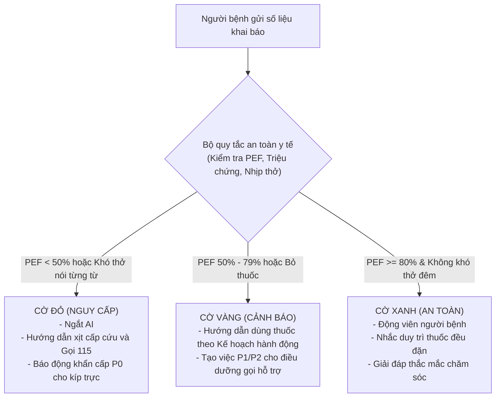

# TÀI LIỆU ĐẶC TẢ HỆ THỐNG CHĂM SÓC BỆNH NHÂN SAU XUẤT VIỆN (AFTERCARE-AI)
## CHUYÊN KHOA HÔ HẤP: QUẢN LÝ VÀ CHĂM SÓC BỆNH NHÂN HEN PHẾ QUẢN SAU XUẤT VIỆN

---

## MỤC 1: TỔNG QUAN HỆ THỐNG

### 1.1. Mục tiêu cốt lõi
Hệ thống giải quyết 2 bài toán trọng tâm trong việc chăm sóc và theo dõi người bệnh **Hen phế quản (suyễn)** tại nhà sau khi xuất viện hoặc sau khi xử trí cấp cứu đợt kịch phát:

1. **Hỏi đáp y tế có đối chiếu nguồn (Medical RAG):** Giải đáp các thắc mắc về chăm sóc tại nhà, hướng dẫn kỹ thuật sử dụng bình xịt định liều, bình hít bột khô, cách dùng buồng đệm, cách vệ sinh dụng cụ, xử trí các tác dụng phụ thường gặp và nhận diện các yếu tố gây dị ứng. Mọi phản hồi đều dựa trên nguồn tài liệu chuyên môn chính thống (Hướng dẫn chẩn đoán và điều trị Hen phế quản của Bộ Y tế Việt Nam, cập nhật theo phác đồ GINA) và luôn có trích dẫn nguồn rõ ràng.
2. **Phân tầng rủi ro người bệnh (Patient Risk Triage):** Tiếp nhận dữ liệu khai báo hằng ngày của người bệnh (chỉ số lưu lượng đỉnh - PEF, số lần dùng thuốc cắt cơn, triệu chứng ngày và đêm, mức độ tuân thủ đơn thuốc), áp dụng bộ quy tắc an toàn y tế cố định kết hợp phân tích chiều hướng tiến triển để phân loại nguy cơ theo 3 mức màu (**XANH**, **VÀNG**, **ĐỎ**). Khi có dấu hiệu nguy hiểm, hệ thống tự động cảnh báo theo Kế hoạch hành động hen và chuyển thông tin ngay cho điều dưỡng hoặc bác sĩ can thiệp.

---

### 1.2. Bảng phân định phạm vi hệ thống

| Trong phạm vi hệ thống và trí tuệ nhân tạo (AI) | Ngoài phạm vi hệ thống và trí tuệ nhân tạo (AI) |
| :--- | :--- |
| **Hỏi đáp y tế có nguồn:** Giải đáp thắc mắc về chăm sóc tại nhà, kỹ thuật dùng thuốc, xử trí tác dụng phụ thông thường, bắt buộc kèm trích dẫn tài liệu y khoa. | **Không chẩn đoán xác định bệnh mới** hoặc thay đổi phác đồ bệnh lý thay cho bác sĩ chuyên khoa hô hấp. |
| **Bộ quy tắc an toàn cố định:** Phân loại dựa trên các ngưỡng số liệu cụ thể (lưu lượng đỉnh PEF, triệu chứng hen, nồng độ oxy trong máu SpO₂). | **Không tự ý kê đơn thuốc mới**, không tự tăng hay giảm liều lượng hoặc yêu cầu người bệnh ngừng thuốc ngoài đơn xuất viện. |
| **Theo dõi tiến triển:** Theo dõi sự thay đổi của lưu lượng đỉnh (PEF sáng và chiều) cùng tần suất xịt thuốc cắt cơn qua từng ngày. | **Không tự động quay số gọi cấp cứu 115** hay điều xe cấp cứu trực tiếp đến nhà người bệnh. |
| **Phân tầng nguy cơ:** Phân loại tình trạng người bệnh theo 3 cấp độ cảnh báo: **VÙNG XANH (An toàn)**, **VÙNG VÀNG (Cảnh báo)**, **VÙNG ĐỎ (Nguy cấp)**. | **Không tích hợp thiết bị phần cứng đo tự động phức tạp** (trong giai đoạn đầu, người bệnh tự đọc số trên đỉnh kế và nhập vào hệ thống). |
| **Quy trình báo động khẩn:** Tự động tạo bản tóm tắt diễn biến bệnh khi cần chuyển tuyến cho điều dưỡng can thiệp. | **Không cam kết khỏi bệnh hoàn toàn** trên bệnh nhân thực tế ngoài đời sống. |
| **Hàng rào an toàn y tế:** Chặn tuyệt đối các hành vi tư vấn đổi thuốc kháng viêm, tự ngưng thuốc hít ngừa cơn hoặc tư vấn sai chuyên khoa. | **Không can thiệp vào hồ sơ bệnh án nội trú** đang lưu trữ tại máy chủ bệnh viện. |
| **Quản lý thông tin ngoại trú:** Lưu trữ lịch sử khai báo, Kế hoạch chăm sóc, dòng thời gian sự kiện, lịch nhắc uống thuốc và lịch hẹn tái khám. | - |

---

### 1.3. Bốn nguyên tắc vận hành cốt lõi

1. **Quy tắc an toàn luôn chạy trước mô hình AI (Rule before model):**
   - Bộ quy tắc an toàn y tế cố định chạy độc lập và có quyền ưu tiên tuyệt đối so với mô hình AI.
   - Khi cờ **ĐỎ** đã bật (ví dụ: lưu lượng đỉnh PEF dưới 50%, khó thở nói từng từ, co kéo lồng ngực), AI tuyệt đối không được phép hạ mức cảnh báo xuống **VÀNG** hoặc **XANH**.
2. **Ưu tiên an toàn khi có sự cố (Fail-safe):**
   - Khi dữ liệu khai báo bị thiếu, số liệu mâu thuẫn bất thường hoặc hệ thống gặp lỗi kết nối, hệ thống phải tự động chuyển ca bệnh sang cho nhân viên y tế xử lý, tuyệt đối không tự cho rằng người bệnh vẫn an toàn.
3. **Mọi khẳng định đều phải có bằng chứng đối chiếu (Evidence before assertion):**
   - Mọi lời khuyên chăm sóc và hướng dẫn dùng thuốc chỉ được trích xuất từ tài liệu đã được thẩm định chuyên môn (Hướng dẫn chẩn đoán và điều trị Hen phế quản của Bộ Y tế Việt Nam) và bắt buộc phải ghi rõ nguồn trích dẫn.
4. **Nhân viên y tế giữ quyền kiểm soát tối cao (Human-in-the-loop):**
   - Mọi quyết định chuyên môn và việc xác nhận xử lý xong một cảnh báo Đỏ bắt buộc phải do điều dưỡng hoặc bác sĩ có chuyên môn trực tiếp xác nhận.

---

## MỤC 2: PHẠM VI LÂM SÀNG VÀ KẾ HOẠCH CHĂM SÓC (CARE PLAN)

### 2.1. Phạm vi bệnh lý hỗ trợ
Hệ thống chuẩn hóa kho kiến thức và bộ quy tắc an toàn cho:
* **Người bệnh hen phế quản từ 12 tuổi trở lên xuất viện sau đợt kịch phát:** Người bệnh vừa trải qua đợt cấp cứu hoặc nằm viện điều trị vì cơn hen cấp (mức độ nhẹ, trung bình hoặc nặng), hiện các triệu chứng đã tạm ổn định và được bác sĩ cho về nhà tiếp tục dùng thuốc.
* **Tài liệu chuyên môn đối chiếu:** Hướng dẫn chẩn đoán và điều trị Hen phế quản ban hành theo Quyết định của Bộ Y tế Việt Nam và phác đồ quốc tế GINA.

---

### 2.2. Lộ trình theo dõi 14 ngày sau xuất viện
* **Khung thời gian:** Tính từ ngày xuất viện và theo dõi liên tục trong vòng **14 ngày (Ngày 1 đến Ngày 14)**. Đây là khoảng thời gian nhạy cảm nhất, người bệnh rất dễ tái phát cơn hen cấp phải nhập viện lại nếu bỏ thuốc kháng viêm đường uống hoặc hít thuốc sai kỹ thuật.
* **Khai báo tình hình hằng ngày (Ngày 1 – Ngày 14):** 
  - Thực hiện 2 lần mỗi ngày: Buổi sáng (khoảng 08:00) và Buổi tối (khoảng 20:00).
  - Các thông tin cần thu thập:
    1. Chỉ số lưu lượng đỉnh (PEF sáng và tối, người bệnh thổi 3 lần vào đỉnh kế và ghi lại số cao nhất).
    2. Triệu chứng khó thở, thở khò khè, nặng ngực, ho.
    3. Số lần phải xịt thuốc cắt cơn trong 24 giờ qua.
    4. Có bị thức giấc vào ban đêm hoặc gần sáng do khó thở hay không.
    5. Khả năng làm việc, đi lại trong nhà có bị hạn chế không.
    6. Xác nhận đã uống thuốc kháng viêm dạng viên (Prednisolone) và đã hít thuốc kiểm soát dạng xịt/hít.
    7. Xác nhận đã súc miệng sạch bằng nước sau khi hít thuốc.
* **Các mốc đánh giá trọng điểm (Ngày 1, Ngày 3, Ngày 7, Ngày 14):**
  - Hệ thống bổ sung thêm các câu hỏi khảo sát chuyên sâu phù hợp với từng mốc phục hồi.
* **Nhắc uống thuốc và lịch hẹn tái khám:**
  - Nhắc uống thuốc kháng viêm dạng viên (uống sau bữa ăn sáng no để tránh đau dạ dày).
  - Nhắc hít thuốc ngừa cơn đều đặn sáng và tối, kèm lời nhắc súc họng sạch sẽ.
  - Nhắc lịch hẹn đến bệnh viện tái khám (trong khoảng 2 đến 7 ngày sau khi xuất viện).

---

### 2.3. Bảng phân chia 3 giai đoạn theo dõi lâm sàng

| Giai đoạn | Trọng tâm theo dõi y tế | Nhiệm vụ của Trợ lý AI |
| :--- | :--- | :--- |
| **Ngày 1 – Ngày 3**<br>*(Giai đoạn sớm sau xuất viện)* | - Theo dõi sự hồi phục của đường thở sau đợt cấp.<br>- Giám sát việc uống thuốc kháng viêm đường uống (Prednisolone hoặc Methylprednisolone).<br>- Theo dõi sự thay đổi của chỉ số lưu lượng đỉnh (PEF) giữa sáng và chiều.<br>- Phát hiện sớm cơn khó thở tái phát.<br>- Kiểm tra người bệnh đã biết cách hít thuốc đúng cách và dùng buồng đệm chưa. | - Gửi phiếu khai báo 2 lần/ngày (sáng 08:30 và tối 20:00).<br>- Nhắc uống thuốc kháng viêm đúng liều sau khi ăn sáng.<br>- **Mốc Ngày 1:** Hướng dẫn kỹ thuật đo lưu lượng đỉnh (thổi 3 lần lấy số lớn nhất) và dặn súc miệng sau khi hít thuốc.<br>- **Mốc Ngày 3:** Đánh giá mức độ tăng của chỉ số PEF so với chỉ số tốt nhất của người bệnh.<br>- Bật cảnh báo ngay nếu người bệnh phải xịt thuốc cắt cơn từ 3 lần/ngày trở lên. |
| **Ngày 4 – Ngày 7**<br>*(Uống dứt điểm thuốc viên & Chuẩn bị tái khám)* | - Đảm bảo người bệnh uống đủ đợt thuốc kháng viêm dạng viên (thường từ 5 đến 7 ngày ở người lớn).<br>- Theo dõi xem cơn hen có bùng phát trở lại khi ngừng thuốc viên hay không.<br>- Đảm bảo duy trì đều đặn thuốc hít ngừa cơn hằng ngày.<br>- Đánh giá mức độ kiểm soát triệu chứng theo 4 câu hỏi chuẩn của Bộ Y tế.<br>- Nhắc người bệnh đi tái khám đúng hẹn. | - Gửi phiếu khai báo sáng và tối hằng ngày.<br>- Nhắc uống hết số thuốc kháng viêm được kê, giải thích rõ không được tự ý bỏ thuốc sớm.<br>- **Mốc Ngày 7:** Đánh giá bảng 4 câu hỏi kiểm soát hen (triệu chứng ban ngày, thức giấc ban đêm, dùng thuốc cắt cơn, giới hạn vận động).<br>- Nhắc kiểm tra lượng thuốc còn lại trong bình xịt và nhắc lịch đi tái khám. |
| **Ngày 8 – Ngày 14**<br>*(Ổn định lâu dài & Phòng ngừa tại nhà)* | - Giữ cho đường thở luôn thông thoáng ổn định (chỉ số PEF đạt từ 80% trở lên).<br>- Bắt đầu vận động thể lực nhẹ nhàng trở lại.<br>- Giữ môi trường sống sạch sẽ (tránh khói thuốc lá, bụi nhà, lông chó mèo, nấm mốc, phấn hoa, gió lạnh).<br>- Rèn luyện thói quen tự quản lý bệnh theo Kế hoạch hành động hen. | - Gửi phiếu khai báo 1 lần/ngày vào buổi tối.<br>- Ghi nhận kết luận sau khi người bệnh đi tái khám về (nếu bác sĩ có đổi thuốc).<br>- Cung cấp các bài hướng dẫn về cách tránh dị nguyên và cách tập thể dục an toàn cho người bệnh hen.<br>- **Mốc Ngày 14:** Tổng kết toàn bộ 14 ngày theo dõi, chuyển người bệnh sang chế độ tự quản lý mạn tính định kỳ. |

---

### 2.4. Quy trình xử lý khi người bệnh không gửi khai báo
- **Nhắc nhở lần 1:** Gửi thông báo trên ứng dụng sau 30 phút kể từ giờ hẹn khai báo.
- **Nhắc nhở lần 2:** Gửi tin nhắn SMS hoặc Zalo sau 2 tiếng nếu người bệnh vẫn chưa phản hồi.
- **Ghi nhận trạng thái bỏ lỡ:** Nếu sau 4 tiếng vẫn không nhận được thông tin.
- **Báo động cho điều dưỡng gọi điện thoại trực tiếp kiểm tra khi:**
  - Người bệnh không khai báo **2 ngày liên tiếp**, HOẶC
  - Người bệnh bỏ lỡ bất kỳ mốc đánh giá quan trọng nào (**Ngày 1, Ngày 3, hoặc Ngày 7**).

---

## MỤC 3: QUY TẮC AN TOÀN VÀ PHÂN LOẠI NGUY CƠ (SAFETY & TRIAGE)

### 3.1. Dấu hiệu báo động đỏ (Red Flags - Cấp cứu khẩn cấp)
Bộ quy tắc an toàn y tế chạy độc lập trước khi chuyển dữ liệu cho AI. Khi phát hiện các dấu hiệu dưới đây, hệ thống lập tức xác định người bệnh đang trong tình trạng nguy cấp:

1. **Chỉ số hô hấp ở mức nguy hiểm:**
   - Chỉ số lưu lượng đỉnh **PEF giảm dưới 50%** so với mức tốt nhất của người bệnh.
   - Nồng độ oxy trong máu **SpO₂ dưới 92%** khi thở khí trời bình thường.
   - Nhịp thở quá nhanh từ **30 lần/phút trở lên**, hoặc thở chậm bất thường dưới 10 lần/phút (dấu hiệu kiệt sức cơ hô hấp).
   - Nhịp tim nhanh trên **120 lần/phút** hoặc loạn nhịp.
2. **Biểu hiện lâm sàng đe dọa tính mạng:**
   - Khó thở dữ dội, không thể nói hết một câu dài, chỉ nói được từng từ đứt quãng.
   - Phải ngồi cúi người ra phía trước, chống tay để thở; co kéo mạnh hõm ức và các cơ liên sườn; vã mồ hôi hột.
   - Môi hoặc đầu ngón tay ngón chân tím tái; người lơ mơ, ngủ gà hoặc hoảng loạn, vật vã.
   - Cơn khó thở không đỡ sau khi đã xịt thuốc cắt cơn đúng cách 2 lần (mỗi lần cách nhau 15–20 phút).

#### Các bước hệ thống xử lý ngay lập tức khi gặp Cờ Đỏ:
1. **Ngắt hoàn toàn cuộc trò chuyện thông thường của AI.**
2. **Khóa màn hình ở chế độ khẩn cấp:** Hướng dẫn người bệnh xịt ngay 2 đến 4 nhát thuốc cắt cơn qua buồng đệm và hiển thị dòng chữ lớn: **"HÃY GỌI NGAY CẤP CỨU 115 HOẶC NHỜ NGƯỜI NHÀ ĐƯA ĐẾN BỆNH VIỆN GẦN NHẤT NGAY LẬP TỨC"**.
3. **Tự động tạo bản báo cáo tóm tắt tình trạng khẩn cấp** gồm các chỉ số PEF, SpO₂, nhịp thở và diễn biến cơn khó thở.
4. **Phát chuông báo động và tạo phiếu công việc mức P0 (Khẩn cấp cao nhất)** gửi thẳng đến bàn trực của điều dưỡng và bác sĩ hô hấp.
5. **Ghi lại nhật ký an toàn:** Lưu vết thời gian kích hoạt, số liệu của người bệnh và trạng thái chờ nhân viên y tế xử lý.

---

### 3.2. Ranh giới an toàn y tế bắt buộc

#### Những việc hệ thống TUYỆT ĐỐI KHÔNG ĐƯỢC LÀM:
- **Không tự ý chẩn đoán bệnh mới:** Không đưa ra kết luận người bệnh mắc thêm bệnh khác như bệnh phổi tắc nghẽn mạn tính (COPD), suy tim hay viêm phổi.
- **Không tự ý kê đơn thuốc:** Không bao giờ tự khuyên người bệnh mua thêm thuốc kháng sinh, thuốc hạ sốt hay bất kỳ thuốc giãn phế quản nào khác.
- **Không tự ý chỉnh liều hay dừng thuốc:** Tuyệt đối không bao giờ bảo người bệnh giảm liều thuốc xịt ngừa cơn hoặc dừng thuốc viên trước thời hạn ghi trong đơn.
- **Không tự động kết nối gọi 115:** Hệ thống không tự động gọi xe cứu thương; trách nhiệm của hệ thống là cảnh báo rõ mức độ nguy hiểm để người bệnh và gia đình chủ động gọi cấp cứu hoặc đến bệnh viện.

---

### 3.3. Ma trận quy tắc an toàn y tế theo từng giai đoạn



#### Chi tiết các quy tắc an toàn:

| Mã quy tắc | Mức cảnh báo | Dấu hiệu / Ngưỡng kích hoạt | Hành động của hệ thống |
| :--- | :---: | :--- | :--- |
| **ASTHMA-RED-01** | **ĐỎ** | Lưu lượng đỉnh **PEF < 50%** HOẶC SpO₂ < 92% HOẶC Nhịp thở $\ge 30$ lần/phút | Ngắt AI ngay; hiện hướng dẫn xịt cấp cứu và gọi 115 lập tức; gửi báo động P0 cho điều dưỡng. |
| **ASTHMA-RED-02** | **ĐỎ** | Khó thở dữ dội, nói từng từ ngắt quãng, tím tái, co kéo lồng ngực, xịt 2 lần thuốc cắt cơn không đỡ | Ngắt AI; báo động suy hô hấp đe dọa tính mạng; yêu cầu người nhà đưa đi cấp cứu ngay. |
| **ASTHMA-YEL-01** | **VÀNG** | Lưu lượng đỉnh **PEF từ 50% đến 79%** (thuộc Vùng Vàng cảnh báo) | Ghi nhận Vàng; hướng dẫn xử trí theo Kế hoạch hành động: xịt 2 nhát thuốc cắt cơn, nghỉ ngơi, đo lại sau 1 giờ; tạo phiếu P1 cho điều dưỡng theo dõi. |
| **ASTHMA-YEL-02** | **VÀNG** | Quên uống thuốc kháng viêm dạng viên buổi sáng hoặc bị đau cồn cào dạ dày | Nhắc uống bổ sung sau khi ăn nhẹ; hướng dẫn cách uống giảm kích ứng dạ dày; tạo phiếu P2 cho điều dưỡng. |
| **ASTHMA-YEL-03** | **VÀNG** | Tự ý dừng thuốc hít ngừa cơn vì thấy "hết khó thở rồi" | Nhắc nhở người bệnh về nguy cơ bùng phát cơn hen nặng; giải thích cơ chế viêm niêm mạc; tạo phiếu P2 để điều dưỡng gọi điện giải thích. |
| **ASTHMA-YEL-04** | **VÀNG** | Bị thức giấc về đêm do ho hoặc khò khè từ 2 đêm trở lên trong tuần | Đánh giá bệnh chưa được kiểm soát tốt; hướng dẫn ghi chú lại để trao đổi với bác sĩ khi tái khám; tạo phiếu P2. |
| **ASTHMA-YEL-05** | **VÀNG** | Phải dùng thuốc cắt cơn từ 3 lần trở lên trong một ngày | Cảnh báo việc lạm dụng thuốc cắt cơn; hướng dẫn kiểm tra lại kỹ thuật hít thuốc; tạo phiếu P1 cho điều dưỡng. |
| **ASTHMA-YEL-06** | **VÀNG** | Bị khàn tiếng kéo dài hoặc xuất hiện mảng trắng trong miệng, rát họng | Nghi ngờ tác dụng phụ đọng thuốc gây nấm miệng; hướng dẫn kỹ thuật súc họng sâu bằng nước ấm; tạo phiếu P2. |
| **ASTHMA-GRN-01** | **XANH** | **PEF $\ge 80\%$**, ngủ yên giấc, không cần xịt cắt cơn, sinh hoạt bình thường | Đánh giá an toàn; gửi lời khen ngợi và dặn dò tiếp tục duy trì thuốc đều đặn mỗi ngày. |

---

### 3.4. Bảng phân cấp ưu tiên xử lý cho nhân viên y tế

| Cấp độ | Tên mức ưu tiên | Tình huống y tế cụ thể | Thời gian tối đa điều dưỡng phải phản hồi | Người chịu trách nhiệm |
| :--- | :--- | :--- | :--- | :--- |
| **P0 (Khẩn cấp)** | **Đe dọa tính mạng** | Cờ Đỏ: PEF < 50%, SpO₂ < 92%, suy hô hấp cấp, khó thở nói từng từ, hen ác tính không đáp ứng thuốc xịt | **Dưới 15 phút** | Điều dưỡng trực cấp cứu + Bác sĩ hô hấp |
| **P1 (Nguy cơ cao)** | **Hen trở nặng** | Cờ Vàng nghiêm trọng: PEF 50–79% kéo dài trên 24 giờ, dùng thuốc cắt cơn từ 3 lần/ngày, bỏ lỡ mốc Ngày 1, 3, 7 | **Dưới 60 phút** | Điều dưỡng theo dõi hô hấp |
| **P2 (Cảnh báo)** | **Cần hỗ trợ dùng thuốc** | Tự ý bỏ thuốc ngừa cơn, quên uống thuốc kháng viêm, thức giấc về đêm $\ge 2$ lần/tuần, bị khàn họng rát miệng | **Dưới 4 giờ** | Điều dưỡng phòng khám ngoại trú |
| **P3 (Thông thường)** | **Hỗ trợ thông tin** | Hỏi về cách đổi lịch tái khám, hỏi cách cọ rửa buồng đệm, hỏi về đồ ăn nên tránh | **Dưới 24 giờ** | Trợ lý chăm sóc / Điều dưỡng hành chính |

---

## MỤC 4: SCHEMA CƠ SỞ DỮ LIỆU (DATABASE SCHEMA)

Toàn bộ hệ thống quản lý dữ liệu người bệnh được thiết kế gồm 14 bảng dữ liệu chính, sử dụng tên bảng và tên cột hoàn toàn bằng tiếng Anh chuẩn kỹ thuật phần mềm, các trường được chuẩn hóa chuyên biệt cho chuyên khoa Hen phế quản:

### 4.1. Bảng `users` — Tài khoản người dùng hệ thống
| Column Name | Data Type | Constraints | Mô tả chức năng |
| :--- | :--- | :--- | :--- |
| `id` | UUID | PRIMARY KEY | Mã định danh duy nhất |
| `full_name` | VARCHAR(255) | NOT NULL | Họ và tên người dùng |
| `phone_number` | VARCHAR(20) | UNIQUE, NOT NULL | Số điện thoại dùng để đăng nhập và nhận tin nhắn khẩn cấp |
| `email` | VARCHAR(255) | UNIQUE | Địa chỉ thư điện tử |
| `role` | VARCHAR(50) | NOT NULL | Vai trò: `PATIENT`, `NURSE`, `DOCTOR`, `ADMIN` |
| `created_at` | TIMESTAMP | DEFAULT NOW() | Thời gian tạo tài khoản |

### 4.2. Bảng `patients` — Hồ sơ bệnh nhân
| Column Name | Data Type | Constraints | Mô tả chức năng |
| :--- | :--- | :--- | :--- |
| `id` | UUID | PRIMARY KEY | Mã hồ sơ bệnh nhân |
| `user_id` | UUID | FK → `users.id` | Khóa ngoại tham chiếu tài khoản người dùng |
| `dob` | DATE | NOT NULL | Ngày tháng năm sinh |
| `gender` | VARCHAR(10) | — | Giới tính: `MALE`, `FEMALE`, `OTHER` |
| `height_cm` | DECIMAL(5,2) | — | Chiều cao tính bằng cm (dùng tính PEF dự đoán) |
| `weight_kg` | DECIMAL(5,2) | — | Cân nặng tính bằng kg (dùng tính liều thuốc kháng viêm) |
| `personal_best_pef` | INT | NOT NULL | **Lưu lượng đỉnh tốt nhất của cá nhân (L/phút)** |
| `predicted_pef` | INT | — | Lưu lượng đỉnh dự đoán theo độ tuổi, giới tính, chiều cao |
| `asthma_step` | INT | NOT NULL | Bậc điều trị hen theo GINA / Bộ Y tế (từ Bậc 1 đến Bậc 5) |
| `allergic_triggers` | TEXT[] | — | Danh sách dị nguyên đã biết (bụi, lông thú, lạnh, phấn hoa...) |
| `emergency_contact` | JSONB | — | Thông tin người thân khẩn cấp (tên, quan hệ, số điện thoại) |

### 4.3. Bảng `care_plans` — Kế hoạch chăm sóc xuất viện
| Column Name | Data Type | Constraints | Mô tả chức năng |
| :--- | :--- | :--- | :--- |
| `id` | UUID | PRIMARY KEY | Mã kế hoạch chăm sóc |
| `patient_id` | UUID | FK → `patients.id` | Bệnh nhân thụ hưởng kế hoạch |
| `care_plan_type` | VARCHAR(50) | DEFAULT 'ASTHMA_POST_EXACERBATION' | Loại kế hoạch: Hậu đợt cấp hen phế quản |
| `discharge_date` | DATE | NOT NULL | Ngày xuất viện |
| `plan_start_date` | DATE | NOT NULL | Ngày bắt đầu theo dõi (Ngày 1 sau xuất viện) |
| `plan_end_date` | DATE | NOT NULL | Ngày kết thúc theo dõi 14 ngày (Ngày 14 sau xuất viện) |
| `green_pef_min` | INT | NOT NULL | Ngưỡng tối thiểu Vùng Xanh (≥ 80% Personal Best) |
| `yellow_pef_min` | INT | NOT NULL | Ngưỡng dưới Vùng Vàng (50% Personal Best) |
| `red_pef_max` | INT | NOT NULL | Ngưỡng trên Vùng Đỏ (< 50% Personal Best) |
| `status` | VARCHAR(50) | DEFAULT 'ACTIVE' | Trạng thái: `ACTIVE`, `COMPLETED`, `ESCALATED`, `CANCELLED` |

### 4.4. Bảng `medications` — Danh mục đơn thuốc xuất viện
| Column Name | Data Type | Constraints | Mô tả chức năng |
| :--- | :--- | :--- | :--- |
| `id` | UUID | PRIMARY KEY | Mã thuốc trong đơn |
| `care_plan_id` | UUID | FK → `care_plans.id` | Khóa ngoại trỏ đến kế hoạch chăm sóc |
| `medication_type` | VARCHAR(50) | NOT NULL | Phân loại: `ORAL_STEROID` (uống), `CONTROLLER` (ngừa cơn), `RELIEVER` (cắt cơn) |
| `medication_name` | VARCHAR(255) | NOT NULL | Tên biệt dược hoặc hoạt chất (Prednisolone, Symbicort, Ventolin) |
| `device_type` | VARCHAR(50) | — | Dạng dụng cụ: `TABLET`, `pMDI`, `DPI`, `NEBULIZER` |
| `dosage` | VARCHAR(100) | NOT NULL | Liều dùng (ví dụ: 40mg, 160/4.5mcg, 100mcg) |
| `frequency` | VARCHAR(100) | NOT NULL | Tần suất dùng (ví dụ: 1 lần/ngày sáng, 2 nhát x 2 lần/ngày) |
| `start_day` | INT | DEFAULT 1 | Ngày bắt đầu dùng trong đợt theo dõi 14 ngày |
| `duration_days` | INT | — | Số ngày dùng (thuốc viên: 5–7 ngày, thuốc hít: liên tục) |
| `instructions` | TEXT | — | Dặn dò bắt buộc (uống sau ăn no, súc họng sạch sau khi hít) |

### 4.5. Bảng `follow_up_appointments` — Lịch hẹn tái khám
| Column Name | Data Type | Constraints | Mô tả chức năng |
| :--- | :--- | :--- | :--- |
| `id` | UUID | PRIMARY KEY | Mã lịch hẹn |
| `care_plan_id` | UUID | FK → `care_plans.id` | Kế hoạch chăm sóc tương ứng |
| `appointment_date`| TIMESTAMP | NOT NULL | Thời gian hẹn tái khám (khuyến cáo sau xuất viện 2–7 ngày) |
| `location` | VARCHAR(255) | — | Địa điểm / Phòng khám chuyên khoa Hô hấp |
| `status` | VARCHAR(50) | DEFAULT 'SCHEDULED' | Trạng thái: `SCHEDULED`, `COMPLETED`, `MISSED`, `RESCHEDULED` |

### 4.6. Bảng `care_plan_versions` — Lịch sử phiên bản kế hoạch chăm sóc
| Column Name | Data Type | Constraints | Mô tả chức năng |
| :--- | :--- | :--- | :--- |
| `id` | UUID | PRIMARY KEY | Mã phiên bản |
| `care_plan_id` | UUID | FK → `care_plans.id` | Kế hoạch chăm sóc gốc |
| `version_number` | INT | NOT NULL | Số thứ tự phiên bản (v1, v2...) |
| `changes_summary`| TEXT | NOT NULL | Tóm tắt lý do cập nhật (sau tái khám, tăng bậc điều trị...) |
| `approved_by` | UUID | FK → `users.id` | Bác sĩ / Điều dưỡng phê duyệt phiên bản mới |
| `created_at` | TIMESTAMP | DEFAULT NOW() | Thời gian cập nhật phiên bản |

### 4.7. Bảng `care_guideline_documents` — Tài liệu hướng dẫn chuyên môn (RAG)
| Column Name | Data Type | Constraints | Mô tả chức năng |
| :--- | :--- | :--- | :--- |
| `id` | UUID | PRIMARY KEY | Mã tài liệu |
| `title` | VARCHAR(255) | NOT NULL | Tên văn bản y khoa (Hướng dẫn điều trị HPQ - Bộ Y tế) |
| `source_authority`| VARCHAR(255)| NOT NULL | Cơ quan ban hành: Bộ Y tế Việt Nam, GINA |
| `version_year` | INT | NOT NULL | Năm ban hành văn bản |
| `content_hash` | VARCHAR(64) | NOT NULL | Mã băm kiểm tra tính toàn vẹn tài liệu |

### 4.8. Bảng `document_chunks` — Đoạn dữ liệu phân mảnh & Vector hóa
| Column Name | Data Type | Constraints | Mô tả chức năng |
| :--- | :--- | :--- | :--- |
| `id` | UUID | PRIMARY KEY | Mã đoạn tài liệu |
| `document_id` | UUID | FK → `care_guideline_documents.id` | Tài liệu nguồn |
| `section_reference`| VARCHAR(255)| — | Vị trí mục trong tài liệu gốc (ví dụ: Mục 2.7.2, Mục 3.3.2) |
| `chunk_content` | TEXT | NOT NULL | Nội dung văn bản y khoa nguyên bản |
| `embedding` | VECTOR(1536) | NOT NULL | Vector embedding phục vụ tìm kiếm ngữ nghĩa chính xác |

### 4.9. Bảng `checkins` — Phiên khai báo sức khỏe của người bệnh
| Column Name | Data Type | Constraints | Mô tả chức năng |
| :--- | :--- | :--- | :--- |
| `id` | UUID | PRIMARY KEY | Mã phiên khai báo |
| `care_plan_id` | UUID | FK → `care_plans.id` | Kế hoạch chăm sóc liên quan |
| `post_discharge_day`| INT | NOT NULL | Ngày thứ mấy sau xuất viện (từ Ngày 1 đến Ngày 14) |
| `session_time` | VARCHAR(20) | NOT NULL | Khung giờ khai báo: `MORNING` hoặc `EVENING` |
| `pef_value` | INT | — | Chỉ số lưu lượng đỉnh đo được (L/phút) |
| `pef_zone` | VARCHAR(20) | — | Vùng màu phân loại: `GREEN`, `YELLOW`, `RED` |
| `reliever_puffs_24h`| INT | DEFAULT 0 | Số nhát thuốc cắt cơn đã dùng trong 24 giờ qua |
| `night_waking` | BOOLEAN | DEFAULT FALSE | Có bị thức giấc về đêm do hen không |
| `daytime_symptoms`| BOOLEAN | DEFAULT FALSE | Có triệu chứng khó thở / khò khè ban ngày không |
| `activity_limited`| BOOLEAN | DEFAULT FALSE | Có bị hạn chế vận động thể lực không |
| `ocs_taken` | BOOLEAN | — | Xác nhận đã uống thuốc viên kháng viêm chưa |
| `controller_taken`| BOOLEAN | — | Xác nhận đã hít thuốc ngừa cơn chưa |
| `mouth_rinsed` | BOOLEAN | — | Xác nhận đã súc họng sạch bằng nước chưa |
| `spo2` | DECIMAL(4,1) | — | Nồng độ oxy trong máu nếu người bệnh có máy đo kẹp tay |
| `heart_rate` | INT | — | Nhịp tim (lần/phút) |
| `respiratory_rate`| INT | — | Tần số thở (lần/phút) |
| `risk_level` | VARCHAR(20) | — | Mức rủi ro do Safety Engine đánh giá: `GREEN`, `YELLOW`, `RED` |
| `status` | VARCHAR(50) | DEFAULT 'COMPLETED' | Trạng thái phiên: `SCHEDULED`, `COMPLETED`, `MISSED` |

### 4.10. Bảng `escalations` — Phiếu chuyển tuyến / Báo động khẩn cấp
| Column Name | Data Type | Constraints | Mô tả chức năng |
| :--- | :--- | :--- | :--- |
| `id` | UUID | PRIMARY KEY | Mã phiếu chuyển tuyến |
| `checkin_id` | UUID | FK → `checkins.id` | Phiên khai báo phát sinh cảnh báo |
| `priority` | VARCHAR(50) | NOT NULL | Mức độ ưu tiên: `P0_CRITICAL`, `P1_HIGH`, `P2_MEDIUM`, `P3_LOW` |
| `triggered_rule` | VARCHAR(100) | NOT NULL | Mã quy tắc kích hoạt (ví dụ: `ASTHMA-RED-01`) |
| `draft_report` | TEXT | NOT NULL | Bản tóm tắt diễn biến nguy hiểm do hệ thống tự sinh |
| `assigned_to` | UUID | FK → `users.id` | Điều dưỡng / Nhân viên y tế phụ trách tiếp nhận |
| `resolution_notes`| TEXT | — | Ghi chú can thiệp lâm sàng bắt buộc trước khi đóng phiếu |
| `status` | VARCHAR(50) | DEFAULT 'OPEN' | Trạng thái: `OPEN`, `IN_PROGRESS`, `RESOLVED` |

### 4.11. Bảng `timeline_events` — Dòng thời gian sự kiện của người bệnh
| Column Name | Data Type | Constraints | Mô tả chức năng |
| :--- | :--- | :--- | :--- |
| `id` | UUID | PRIMARY KEY | Mã sự kiện |
| `patient_id` | UUID | FK → `patients.id` | Khóa ngoại tham chiếu người bệnh |
| `event_type` | VARCHAR(50) | NOT NULL | Loại sự kiện: `DISCHARGE`, `CHECKIN`, `ESCALATION`, `APPOINTMENT` |
| `event_data` | JSONB | — | Chi tiết dữ liệu sự kiện tại thời điểm đó |
| `occurred_at` | TIMESTAMP | DEFAULT NOW() | Thời gian diễn ra sự kiện |

### 4.12. Bảng `notifications` — Lịch sử gửi thông báo
| Column Name | Data Type | Constraints | Mô tả chức năng |
| :--- | :--- | :--- | :--- |
| `id` | UUID | PRIMARY KEY | Mã thông báo |
| `patient_id` | UUID | FK → `patients.id` | Người bệnh nhận thông báo |
| `channel` | VARCHAR(50) | NOT NULL | Kênh gửi: `APP_PUSH`, `SMS`, `ZALO` |
| `notification_type`| VARCHAR(50) | NOT NULL | Loại: `CHECKIN_REMINDER`, `MED_REMINDER`, `APPOINTMENT_REMINDER` |
| `status` | VARCHAR(50) | NOT NULL | Trạng thái gửi: `SENT`, `DELIVERED`, `FAILED` |
| `sent_at` | TIMESTAMP | DEFAULT NOW() | Thời điểm gửi thông báo |

### 4.13. Bảng `agent_actions_log` — Nhật ký hành động của Trợ lý AI
| Column Name | Data Type | Constraints | Mô tả chức năng |
| :--- | :--- | :--- | :--- |
| `id` | UUID | PRIMARY KEY | Mã hành động AI |
| `checkin_id` | UUID | FK → `checkins.id` | Phiên khai báo liên quan |
| `action_name` | VARCHAR(100) | NOT NULL | Tên hành động: `TRIAGE_EVALUATED`, `RAG_QUERY`, `ESCALATION_FIRED` |
| `input_payload` | JSONB | — | Dữ liệu đầu vào của Agent |
| `output_payload`| JSONB | — | Phản hồi do Agent sinh ra |
| `citations` | JSONB | — | Danh sách nguồn tài liệu tham chiếu RAG |
| `created_at` | TIMESTAMP | DEFAULT NOW() | Thời điểm ghi nhận |

### 4.14. Bảng `audit_logs` — Nhật ký kiểm toán và an toàn y tế
| Column Name | Data Type | Constraints | Mô tả chức năng |
| :--- | :--- | :--- | :--- |
| `id` | UUID | PRIMARY KEY | Mã nhật ký kiểm toán |
| `user_id` | UUID | FK → `users.id` | Người dùng phát sinh hành động |
| `guardrail_type`| VARCHAR(100) | NOT NULL | Chốt chặn an toàn: `RULE_BEFORE_MODEL`, `MED_SAFETY_GUARD`, `EMERGENCY_INTERRUPT` |
| `decision` | VARCHAR(50) | NOT NULL | Quyết định: `PASSED`, `BLOCKED`, `ESCALATED` |
| `details` | JSONB | — | Chi tiết kỹ thuật phục vụ thanh tra y tế |
| `logged_at` | TIMESTAMP | DEFAULT NOW() | Thời điểm ghi log kiểm toán |

---

## MỤC 5: KỊCH BẢN MÔ PHỎNG CHI TIẾT (SCENARIOS)

---

### 5.1. Kịch bản 1: Người bệnh trưởng thành sau đợt cấp hen trung bình đến nặng

#### 5.1.1. Hồ sơ bệnh nhân giả lập
* **Mã ca bệnh:** `KB_HEN_NGUOI_LON_01`
* **Thông tin cá nhân:** Bệnh nhân Nam, 42 tuổi, làm việc văn phòng tại Hà Nội.
* **Chẩn đoán ra viện:** Đợt cấp hen phế quản mức độ trung bình – nặng trên nền Hen phế quản bậc 3.
* **Thời điểm xuất viện:** Sau 48 giờ nằm viện xử trí cắt cơn và theo dõi tại khoa Cấp cứu / Hô hấp.
* **Tình trạng lúc ra viện:**
  - Nhịp tim: 78 lần/phút; Huyết áp: 120/75 mmHg; Nồng độ oxy SpO₂: 98% (thở khí phòng); Nhịp thở: 18 lần/phút.
  - Nghe phổi: Thông khí 2 bên rõ, còn ít tiếng rít rải rác ở thì thở ra. Không còn co kéo lồng ngực.
  - **Lưu lượng đỉnh tốt nhất của người bệnh (PEF tốt nhất):** $450\text{ lít/phút}$.
  - **Phân vùng Kế hoạch hành động hen cá nhân hóa:**
    - **Vùng Xanh (An toàn - từ 80% trở lên):** Chỉ số PEF đạt từ **$360\text{ lít/phút}$** trở lên.
    - **Vùng Vàng (Cảnh báo - từ 50% đến 79%):** Chỉ số PEF từ **$225\text{ đến }359\text{ lít/phút}$**.
    - **Vùng Đỏ (Nguy cấp - dưới 50%):** Chỉ số PEF dưới **$225\text{ lít/phút}$**.
* **Đơn thuốc xuất viện:**
  1. Prednisolone 5mg (thuốc kháng viêm dạng viên): Uống 8 viên (40mg)/ngày sau khi ăn sáng no x 5 ngày liên tục (từ Ngày 1 đến Ngày 5).
  2. Symbicort 160/4.5 mcg (thuốc hít ngừa cơn phối hợp): Hít 2 nhát x 2 lần/ngày (buổi sáng 08:00 và buổi tối 20:00).
  3. Ventolin 100mcg (thuốc xịt cắt cơn nhanh): Xịt 1–2 nhát khi thấy khó thở (kèm buồng đệm AeroChamber).
  4. Lịch hẹn tái khám: Sáng Ngày 5 sau khi xuất viện tại phòng khám Hô hấp.

---

#### 5.1.2. Kế hoạch chăm sóc và lịch trình can thiệp (Ngày 1 đến Ngày 14)

| Giai đoạn | Trọng tâm theo dõi y tế | Nhiệm vụ của Trợ lý AI |
| :--- | :--- | :--- |
| **Ngày 1 – Ngày 3** | Kiểm soát đợt sưng viêm cấp; đảm bảo uống thuốc viên Prednisolone đủ liều; đo lưu lượng đỉnh PEF sáng và chiều; phát hiện cơn hen tái phát sớm; kiểm tra kỹ thuật hít thuốc. | Gửi phiếu khai báo 2 lần/ngày (08:30 và 20:00); mốc Ngày 1 hướng dẫn thổi 3 lần lấy số cao nhất và dặn súc miệng sâu sau khi hít Symbicort; nhắc uống Prednisolone sau ăn sáng; bật cờ vàng ngay nếu người bệnh phải xịt Ventolin từ 3 lần/ngày. |
| **Ngày 4 – Ngày 7** | Giám sát uống hết 5 ngày thuốc viên Prednisolone; theo dõi xem ngưng thuốc viên có bị khó thở lại không; đánh giá 4 câu hỏi kiểm soát hen; nhắc đi tái khám mốc Ngày 5 đến Ngày 7. | Gửi phiếu khai báo sáng và tối; nhắc uống nốt liều thuốc viên Ngày 5; mốc Ngày 7 kiểm tra 4 câu hỏi kiểm soát hen và nhắc xem bình xịt còn thuốc không; cập nhật kết quả sau khi người bệnh đi tái khám về. |
| **Ngày 8 – Ngày 14** | Giữ chỉ số PEF luôn nằm trong Vùng Xanh ($\ge 80\%$); kiểm soát bụi bẩn trong phòng ngủ và điều hòa; tập thể dục đi bộ nhẹ nhàng. | Gửi phiếu khai báo 1 lần/ngày vào buổi tối; theo dõi tính đều đặn khi hít thuốc ngừa cơn lâu dài; mốc Ngày 14 tổng kết toàn bộ 14 ngày và kết thúc đợt theo dõi sau xuất viện. |

---

#### 5.1.3. Bốn nhánh tương tác mô phỏng thực tế

##### Nhánh A — Tiến triển thuận lợi (Nhánh hồi phục tốt)
* **Thời điểm:** Sáng Ngày 2 sau xuất viện – 08:30.
* **Người bệnh gửi số liệu qua phiếu khai báo:**
  - Lưu lượng đỉnh PEF sáng: $390\text{ lít/phút}$ (đạt $86.6\%$ so với mức tốt nhất $\rightarrow$ Nằm trong Vùng Xanh an toàn).
  - Triệu chứng: Đêm qua ngủ ngon giấc không bị thức dậy, sáng dậy không khò khè, đi lại trong nhà bình thường.
  - Thuốc cắt cơn: Không phải xịt nhát nào trong suốt 24 giờ qua.
  - Xác nhận đã uống 8 viên Prednisolone sau bữa ăn sáng và đã hít 2 nhát Symbicort kèm súc họng sạch.
* **Cách hệ thống xử lý:**
  - *Bộ quy tắc an toàn:* Khớp với quy tắc an toàn `ASTHMA-GRN-01` (Vùng Xanh).
  - *Phản hồi của Trợ lý AI:*
    > "Chào anh Nam! Số đo lưu lượng đỉnh sáng nay của anh đạt 390 lít/phút, nằm rất tốt trong **Vùng Xanh an toàn** (trên 80%). Việc đêm qua anh ngủ tròn giấc và không phải dùng đến bình xịt cắt cơn cho thấy phế quản của anh đang hồi phục rất tốt sau đợt cấp.  
    > Anh tiếp tục duy trì uống thuốc viên Prednisolone đúng liều sau bữa ăn sáng (hôm nay là ngày thứ 2 trong đợt 5 ngày) và hít thuốc Symbicort đều đặn sáng - tối nhé. Anh nhớ súc miệng kỹ bằng nước ấm và nhổ bỏ sau mỗi lần hít thuốc để cổ họng luôn sạch sẽ. Chúc anh một ngày dễ chịu!"
* **Ghi nhận lịch sử:** Đánh giá mức rủi ro XANH, vẽ điểm số 390 lên biểu đồ hồi phục.

---

##### Nhánh B — Cơn hen tái phát nguy kịch lúc nửa đêm (Nhánh báo động Cờ Đỏ)
* **Thời điểm xảy ra:** 02:15 sáng Ngày 4 sau xuất viện.
* **Tin nhắn khẩn cấp của người bệnh gửi lên ứng dụng:**
  > "Tôi tự nhiên khó thở dữ dội lúc nửa đêm, ngực nghẹn tắc lại không thở được, phải ngồi dậy chống tay ra trước, chỉ nói được vài từ đứt quãng. Tôi thổi đỉnh kế thử chỉ được 180 thôi. Vừa xịt 2 nhát bình Ventolin qua buồng đệm được 15 phút rồi mà ngực vẫn rít nghẹt không đỡ."
* **Cách hệ thống kỹ thuật xử lý:**
  1. **Bộ quy tắc an toàn cố định kiểm tra ngay lập tức:**
     - Lưu lượng đỉnh đo được: $\text{PEF} = 180\text{ lít/phút} < 225\text{ lít/phút}$ (chỉ đạt $40\%$ mức tốt nhất, dưới ngưỡng 50% nguy kịch).
     - Triệu chứng: Khó thở cấp nửa đêm, phải ngồi cúi người, chỉ nói được từng từ, xịt thuốc cắt cơn 1 lần không đỡ.
     - **Kích hoạt ngay:** Quy tắc khẩn cấp `ASTHMA-RED-01` và `ASTHMA-RED-02`.
  2. **Ngắt lập tức luồng AI thông thường:** Khóa toàn bộ khung chat thông thường để ngăn AI trả lời lòng vòng làm lỡ thời gian vàng cấp cứu.
  3. **Tạo phiếu công việc khẩn cấp P0 (Khẩn cấp cao nhất) và phát chuông báo:**
     ```
     [BÁO ĐỘNG ĐỎ KHẨN CẤP - PHIẾU CÔNG VIỆC #HEN-9021]
     Người bệnh: Bệnh nhân Nam (42 tuổi) - Theo dõi Ngày 4 sau xuất viện
     Cảnh báo: CỜ ĐỎ - Nghi đợt cấp hen phế quản nặng tái phát / Nguy cơ suy hô hấp cấp
     Số liệu thực tế ghi nhận:
     - Lưu lượng đỉnh PEF: 180 lít/phút (chỉ đạt 40% mức tốt nhất, tụt sâu vào Vùng Đỏ)
     - Khó thở dữ dội lúc 2 giờ sáng, tư thế ngồi cúi ra trước, co kéo lồng ngực
     - Chỉ nói được từng từ đứt quãng
     - Thất bại cắt cơn: Không thuyên giảm sau 2 nhát xịt Salbutamol cách đây 15 phút
     Hành động yêu cầu: Điều dưỡng trực gọi điện kiểm tra ngay lập tức, hỗ trợ đưa đi cấp cứu.
     ```
  4. **Màn hình ứng dụng người bệnh chuyển sang giao diện khẩn cấp màu đỏ:**
     > **🚨 BÁO ĐỘNG NGUY HIỂM TÍNH MẠNG (VÙNG ĐỎ - CẦN CẤP CỨU NGAY)**  
     > **Chỉ số thở và triệu chứng của bạn đang ở mức rất nguy hiểm! Hãy làm ngay các bước sau:**  
     > 1. **GỌI NGAY CẤP CỨU 115** hoặc nhờ người thân đưa đến **KHOA CẤP CỨU BỆNH VIỆN GẦN NHẤT NGAY LẬP TỨC**.  
     > 2. Trong lúc chờ xe: Ngồi thẳng người hoặc hơi cúi về phía trước (tuyệt đối không được nằm ngửa).  
     > 3. Tiếp tục xịt thêm **2 đến 4 nhát Ventolin** qua buồng đệm, hít sâu từ từ và nín thở 5–10 giây sau mỗi nhát.  
     > *(Hệ thống đã tự động gửi báo động khẩn cấp đến bàn trực của nhân viên y tế phụ trách).*
  5. **Nhân viên y tế can thiệp:** Màn hình ứng dụng của người bệnh giữ nguyên chỉ dẫn cấp cứu này cho đến khi điều dưỡng trực gọi điện xác nhận người bệnh đã được đưa vào viện an toàn và bấm nút xác nhận trên hệ thống.

---

##### Nhánh C — Người bệnh tự ý bỏ thuốc ngừa cơn (Nhánh cảnh báo Cờ Vàng)
* **Thời điểm xảy ra:** 20:00 tối Ngày 5 sau xuất viện.
* **Người bệnh gửi số liệu qua phiếu khai báo và nhắn tin:**
  - Lưu lượng đỉnh PEF tối: $290\text{ lít/phút}$ (đạt $64.4\%$ mức tốt nhất $\rightarrow$ Rơi vào Vùng Vàng cảnh báo).
  - Triệu chứng: Chiều nay đi lên cầu thang thấy thở khò khè, nặng ngực, trong ngày đã phải xịt bình Ventolin 2 lần.
  - Lý do: *"Hôm qua tôi thấy trong người khỏe bình thường rồi nên tôi không hít bình Symbicort nữa, sợ thuốc hít nhiều hại họng với bị nghiện thuốc. Khi nào thấy hơi mệt mệt tôi mới xịt bình Ventolin thôi."*
* **Cách hệ thống kỹ thuật xử lý:**
  1. **Bộ quy tắc an toàn kiểm tra:**
     - PEF nằm trong khoảng $50\% - 79\%$ ($290\text{ lít/phút}$) $\rightarrow$ Kích hoạt quy tắc `ASTHMA-YEL-01`.
     - Tự ý bỏ thuốc hít ngừa cơn + phải xịt thuốc cắt cơn nhiều lần trong ngày $\rightarrow$ Kích hoạt quy tắc `ASTHMA-YEL-03` và `ASTHMA-YEL-05`.
  2. **Tạo phiếu công việc P2 (Mức cảnh báo) gửi điều dưỡng:** Tiêu đề: *"Người bệnh tự ý bỏ thuốc hít ngừa cơn Symbicort, PEF giảm về Vùng Vàng (64%), có nguy cơ bùng phát cơn hen nặng."*
  3. **Trợ lý AI gửi phản hồi giải thích cặn kẽ dựa trên tài liệu Bộ Y tế:**
     > "Chào anh Nam, hệ thống nhận thấy chỉ số lưu lượng đỉnh tối nay của anh đang giảm xuống 290 lít/phút (thuộc **Vùng Vàng - Cảnh báo**), đồng thời anh đã phải xịt thuốc cắt cơn 2 lần trong ngày.  
     >  
     > ⚠️ **Lời khuyên y tế đặc biệt quan trọng về việc dùng thuốc:**  
     > Thuốc hít Symbicort là **thuốc ngừa cơn (kiểm soát)** có nhiệm vụ chữa lành vết sưng viêm âm thầm sâu trong lòng phế quản. Dù anh cảm thấy khỏe, vết viêm này vẫn tồn tại nếu không có thuốc bảo vệ. Bình xịt màu xanh (Ventolin) chỉ tạm thời làm giãn phế quản trong vài tiếng chứ không chữa được ổ viêm. Việc tự ý bỏ thuốc hít ngừa cơn và chỉ xịt thuốc cắt cơn khi mệt là nguyên nhân phổ biến nhất khiến cơn hen bùng phát nặng trở lại phải đi cấp cứu [Theo Hướng dẫn điều trị Hen phế quản - Bộ Y tế, Mục 2.7.2].  
     >  
     > 👉 **Hướng dẫn xử trí ngay lúc này:**  
     > 1. Anh hãy xịt ngay 2 nhát bình Ventolin qua buồng đệm để giải phóng tình trạng tức ngực hiện tại, ngồi nghỉ ngơi 30 phút rồi thổi lại đỉnh kế.  
     > 2. Tiếp tục dùng cữ thuốc hít ngừa cơn Symbicort tối nay theo đúng đơn của bác sĩ. Sau khi hít xong, anh chỉ cần súc miệng và súc họng sạch bằng nước ấm rồi nhổ đi là sẽ không bị khàn giọng hay hại cổ họng.  
     > 3. Điều dưỡng phụ trách đã nhận được thông tin và sẽ gọi điện trao đổi trực tiếp với anh vào sáng mai nhé."

---

##### Nhánh D — Hỏi đáp y tế có nguồn về tác dụng phụ của thuốc (Hệ thống RAG)
* **Thời điểm xảy ra:** Sáng Ngày 3 sau xuất viện – 10:15.
* **Câu hỏi của người bệnh:**
  > "Tôi hít bình Symbicort được 2 hôm nay thấy cổ họng bị rát và giọng nói khàn đặc. Có phải tôi bị dị ứng thuốc không, tôi có nên dừng thuốc lại không?"
* **Cách hệ thống kỹ thuật xử lý:**
  1. **Kiểm tra an toàn:** Câu hỏi không chứa dấu hiệu cấp cứu Cờ Đỏ, không yêu cầu kê thuốc mới; thuộc phạm vi giải thích triệu chứng thường gặp khi dùng thuốc xịt/hít.
  2. **Tìm kiếm bằng chứng y khoa trong tài liệu Bộ Y tế:**
     - Trích xuất từ tài liệu Hướng dẫn Hen phế quản Bộ Y tế (Mục 2.7.2 và Mục 3.3.2): Thuốc hít chứa Corticoid khi hít không đúng cách sẽ đọng lại ở niêm mạc họng và thanh quản, gây khàn tiếng hoặc nấm miệng; cách khắc phục hiệu quả là súc họng sâu bằng nước sạch và nhổ đi ngay sau khi hít thuốc.
  3. **Phản hồi của Trợ lý AI (có dẫn chứng y khoa):**
     > "Chào anh Nam! Triệu chứng khàn giọng và rát họng là tác dụng phụ tại chỗ khá thường gặp khi dùng thuốc hít ngừa cơn chứa chất kháng viêm Corticoid (như thành phần Budesonide trong Symbicort), chứ **không phải do dị ứng thuốc** [Trích dẫn: Hướng dẫn chẩn đoán và điều trị Hen phế quản - Bộ Y tế, Mục 2.7.2].  
     >  
     > Nguyên nhân là do một lượng nhỏ hạt thuốc li ti bị đọng lại ở vùng dây thanh âm và vòm họng trong lúc anh hít thuốc vào.  
     >  
     > 👉 **Cách khắc phục rất đơn giản và hiệu quả:**  
     > 1. **Súc họng đúng cách:** Ngay sau khi hít thuốc xong, anh hãy ngậm một ngụm nước ấm, ngửa cổ súc sâu trong cổ họng khoảng 10–15 giây rồi **nhổ bỏ ra ngoài** (lặp lại 2–3 lần). Tuyệt đối không được nuốt nước súc miệng này.  
     > 2. **Kỹ thuật hít thuốc:** Khi hít, anh ngậm chặt miệng quanh đầu ngậm, hít một hơi thật sâu và dứt khoát, sau đó nín thở khoảng 5–10 giây để thuốc đi thẳng sâu vào phổi thay vì đọng lại ở họng.  
     > 3. **Tuyệt đối không tự ý ngưng thuốc:** Anh không được tự dừng thuốc ngừa cơn vì sẽ làm tăng nguy cơ tái phát cơn khó thở cấp.  
     >  
     > Nếu sau vài ngày anh đã súc họng kỹ mà tình trạng rát họng không đỡ hoặc trong miệng xuất hiện các mảng bám màu trắng (dấu hiệu nấm miệng), anh hãy thông báo lại để điều dưỡng hỗ trợ kiểm tra hoặc trao đổi với bác sĩ trong đợt tái khám mốc Ngày 5 nhé!"

---

### 5.2. Kịch bản 2: Người bệnh trẻ tuổi hen do dị ứng lông mèo và hen khi gắng sức

#### 5.2.1. Hồ sơ bệnh nhân giả lập
* **Mã ca bệnh:** `KB_HEN_TRE_TUOI_02`
* **Thông tin cá nhân:** Bệnh nhân Nữ, 19 tuổi, sinh viên đại học thuê trọ tại TP.HCM.
* **Chẩn đoán ra viện:** Đợt cấp hen phế quản mức độ trung bình do tiếp xúc lông mèo kết hợp vận động gắng sức / Hen phế quản bậc 2 dị ứng.
* **Tình trạng lúc ra viện:**
  - Nhịp tim: 80 lần/phút; Huyết áp: 110/70 mmHg; SpO₂: 98%; Nhịp thở: 18 lần/phút.
  - Tiền sử: Viêm mũi dị ứng, dị ứng lông chó mèo.
  - **Lưu lượng đỉnh tốt nhất của người bệnh (PEF tốt nhất):** $380\text{ lít/phút}$.
  - **Ngưỡng Kế hoạch hành động hen:**
    - Vùng Xanh ($\ge 80\%$): Từ **$304\text{ lít/phút}$** trở lên.
    - Vùng Vàng ($50\% - 79\%$): Từ **$190\text{ đến }303\text{ lít/phút}$**.
    - Vùng Đỏ ($< 50\%$): Dưới **$190\text{ lít/phút}$**.
* **Đơn thuốc xuất viện:**
  1. Methylprednisolone 16mg: Uống 1 viên vào buổi sáng sau khi ăn no x 5 ngày.
  2. Seretide Evohaler 125/25mcg (bình xịt định liều): Xịt 2 nhát x 2 lần/ngày (sáng và tối) qua buồng đệm.
  3. Ventolin 100mcg: Xịt 1–2 nhát trước khi tập thể dục 15 phút hoặc xịt khi có cơn khó thở.
  4. Lịch hẹn tái khám: Sau xuất viện 7 ngày.

---

#### 5.2.2. Nhánh mô phỏng người bệnh tái tiếp xúc dị nguyên (Cờ Vàng)
* **Thời điểm xảy ra:** 16:30 chiều Ngày 6 sau xuất viện.
* **Tình huống:** Bệnh nhân sang phòng trọ của bạn chơi có nuôi mèo khoảng 1 tiếng, sau đó bị ngứa mũi, hắt hơi liên tục, tức ngực và thở rít. Thổi đỉnh kế tại chỗ đạt **$240\text{ lít/phút}$** (chỉ đạt $63.1\%$ mức tốt nhất $\rightarrow$ Rơi vào Vùng Vàng).
* **Xử lý của hệ thống:**
  1. **Quy tắc an toàn kích hoạt:** Xác định PEF rơi vào Vùng Vàng ($240\text{ lít/phút}$) kèm yếu tố khởi phát dị nguyên lông mèo rõ rệt $\rightarrow$ Bật cảnh báo Cờ Vàng.
  2. **Tạo phiếu công việc P1 gửi điều dưỡng:** Cảnh báo bệnh nhân tái tiếp xúc dị nguyên gây co thắt phế quản.
  3. **Chỉ dẫn tức thì của Trợ lý AI theo Kế hoạch hành động:**
     > "⚠️ **CẢNH BÁO: CHỈ SỐ THỞ CỦA BẠN ĐANG Ở VÙNG VÀNG (ĐANG CO THẮT PHẾ QUẢN)**  
     > Bạn đang có phản ứng co thắt đường thở do tiếp xúc với lông mèo. Hãy làm ngay các bước sau:  
     > 1. **Rời khỏi phòng có mèo ngay lập tức**, ra nơi thoáng mát, sạch sẽ.  
     > 2. **Xịt ngay 2 nhát thuốc cắt cơn Ventolin** qua buồng đệm, hít sâu từ từ và nín thở 5–10 giây.  
     > 3. Rửa sạch mặt, mũi, súc miệng và thay quần áo khác để loại bỏ hết lông mèo dính trên người.  
     > 4. Ngồi nghỉ ngơi và thổi lại đỉnh kế sau 20 phút.  
     > *Nếu sau 20 phút mà chỉ số PEF vẫn không lên lại trên 300 lít/phút hoặc thấy khó thở tăng lên: hãy nhờ bạn bè đưa đến bệnh viện gần nhất ngay nhé!*"

---

## MỤC 6: NGUYÊN TẮC VẬN HÀNH VÀ KIỂM SOÁT AN TOÀN

### 6.1. Sơ đồ xử lý tổng quát

```
                     Người bệnh gửi số liệu khai báo hằng ngày
                                        │
                                        ▼
                     Bộ quy tắc an toàn y tế cố định kiểm tra
                     (Kiểm tra chỉ số PEF, nhịp thở, độ khó thở)
                                        │
             ┌──────────────────────────┼──────────────────────────┐
             │                          │                          │
             ▼                          ▼                          ▼
      [CỜ ĐỎ - NGUY CẤP]        [CỜ VÀNG - CẢNH BÁO]       [CỜ XANH - AN TOÀN]
             │                          │                          │
       Ngắt cuộc chat AI         Ghi nhận cảnh báo          Tiếp tục theo dõi
             │                          │                          │
    ┌────────┴────────┐                 │                    Gửi lời khen ngợi
    │                 │          Chỉ dẫn xử trí                    │
Hướng dẫn đi      Tạo phiếu      theo Kế hoạch              Trợ lý AI giải đáp
cấp cứu & gọi 115 việc P0        hành động hen              thắc mắc có nguồn
    │                 │                 │                          │
Khóa màn hình     Báo kíp trực   Tạo việc P1/P2             Nhắc lịch uống thuốc
khẩn cấp          điều dưỡng     cho điều dưỡng             và lịch hẹn tái khám
    │                 │                 │                          │
    └────────┬────────┘                 │                          │
             │                          │                          │
             ▼                          ▼                          ▼
      Lưu nhật ký kiểm toán      Lưu nhật ký kiểm toán      Lưu nhật ký kiểm toán
      (Lưu lại số liệu cờ đỏ)    (Lưu lại số liệu cờ vàng)  (Cập nhật điểm biểu đồ)
```

---

### 6.2. Cam kết an toàn và kiểm chuẩn y khoa
1. **Quy tắc an toàn luôn chạy trước mô hình AI:** Mọi số liệu người bệnh gửi lên đều phải đi qua bộ lọc quy tắc số học cứng trước khi chuyển sang cho mô hình ngôn ngữ xử lý.
2. **AI không có quyền hạ mức nguy hiểm:** Khi bộ quy tắc an toàn đã kết luận là cờ ĐỎ, AI không được phép can thiệp để hạ xuống mức VÀNG hay XANH.
3. **Ưu tiên an toàn khi thiếu dữ liệu:** Khi dữ liệu bị thiếu hoặc câu trả lời bất nhất, hệ thống tự động coi đây là ca bệnh cần lưu ý và chuyển sang điều dưỡng kiểm tra, không tự ý coi là an toàn.
4. **Mọi câu trả lời đều bám sát tài liệu Bộ Y tế:** Mọi hướng dẫn dùng thuốc, súc miệng, kỹ thuật bình xịt và kiêng cữ đều phải trích xuất chính xác từ cẩm nang chuyên môn đã kiểm duyệt và có ghi rõ số mục trích dẫn.
5. **Có sự giám sát trực tiếp của nhân viên y tế:** Phiếu báo động khẩn cấp chỉ được khép lại khi điều dưỡng hoặc bác sĩ phụ trách đã liên hệ với người bệnh, xác nhận hướng xử lý và ghi chú rõ vào hồ sơ.
6. **Mọi hành động đều được lưu vết:** Toàn bộ lịch sử khai báo, mã quy tắc vi phạm và câu trả lời của AI đều được lưu giữ đầy đủ để phục vụ công tác thanh tra, kiểm định chất lượng y tế.
